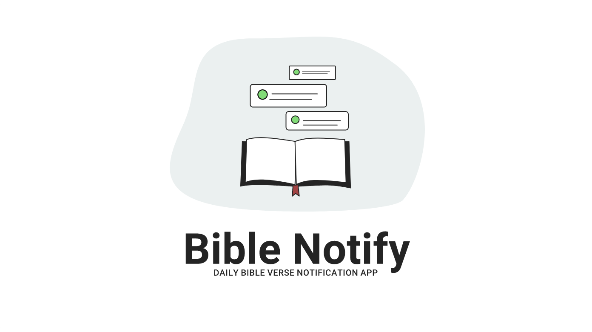

  
  <h1>Bible Notify</h1>
  

  
  
  

  
Daily Scripture Verse Notifications on Android devices.

  
<i>Thy word is a lamp unto my feet, and a light unto my path." -Psalms 119:105</i>

## What is Bible Notify?

Bible Notify is a free daily Bible verse notification application for Android devices. Get daily Bible verse notifications from your Android device with the free & open-source Bible Notify app to meditate on the Scriptures. 

## Desktop version

[Bible Notify Desktop](https://github.com/BibleNotify/BibleNotifyDesktop) is a desktop version (currently in development) for Linux, Windows and macOs platforms.

## Element chat

Need help? Want to help out? [Join our Element chat](https://matrix.to/#/#bible-notify:matrix.org) to chat with the developers or get support.

## Contributing

Contributions are always welcome! Feel free to open a PR or ask questions.

## License

Bible Notify is licensed under the GPL-3.0 License.
